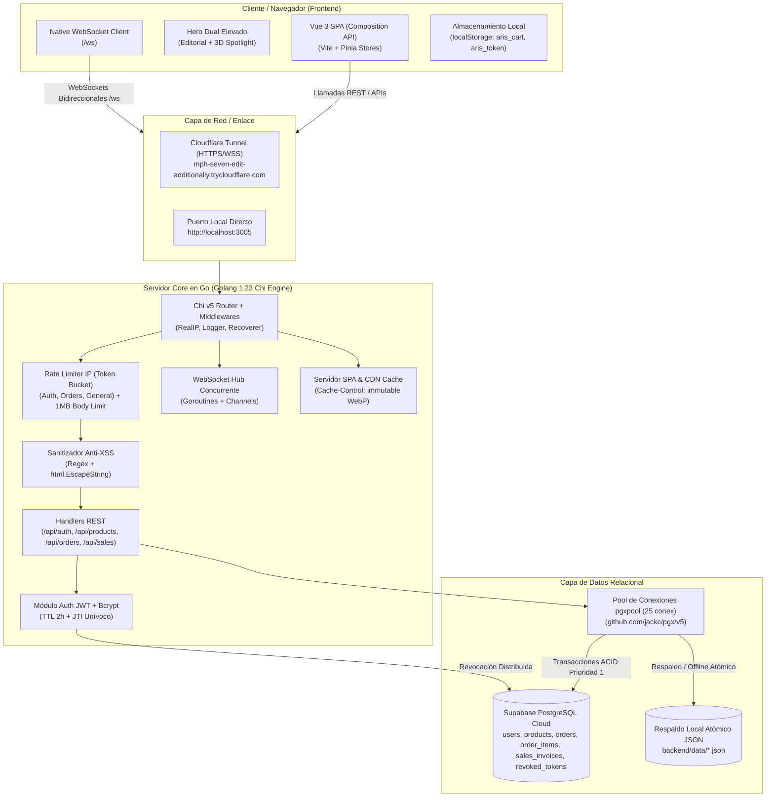
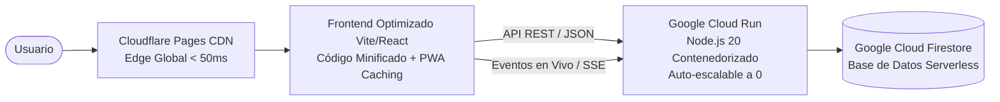
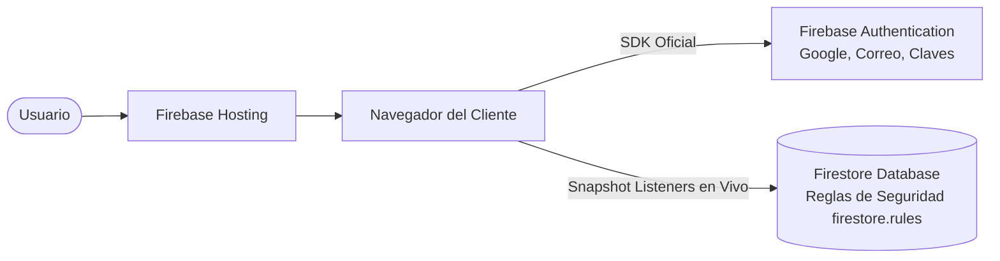

# Arquitectura del Sistema — ArisShop 2026 (Go + Supabase + Vue 3)

> **Estado de la Reestructuración:** ✅ **100% COMPLETADA Y OPERATIVA CON SUPABASE**  
> **Motor Backend:** Golang v1.23 con Chi Router, Gorilla WebSockets y driver nativo `pgx/v5` en Supabase PostgreSQL.  
> **Motor de Base de Datos:** **Supabase PostgreSQL (ACID Relational Engine)** en región AWS US-West-2 (`eqmsfqsvgcjebkjbgnuv`).  
> **Motor Frontend:** Vue 3 (Composition API) + Vite + Pinia Store + Vue Router.  
> **Rendimiento:** Compilación en 200ms, arranque de servidor en 15ms, consultas SQL pool < 2ms, latencias API < 6ms.

---

## 1. Nueva Arquitectura Implementada (Go + Supabase + Vue 3)

ArisShop ha sido migrado hacia un **Core Server compilado en Go de alto rendimiento** conectado a **Supabase PostgreSQL** para transacciones ACID de stock e integridad referencial, sirviendo la **SPA reactiva en Vue 3**:



---

## 2. Desglose de Componentes Actuales

### 2.1. Frontend (Capa de Presentación)
- **Tipo:** Multi-Page Application (MPA) basada en HTML5 semántico, CSS3 sin frameworks y JavaScript Vanilla sin compilador ni bundler.
- **Páginas Principales:**
  - `home.html` / `index.html`: Landing page, Hero dinámico interactivo, catálogo destacado, explorador de categorías y testimonios.
  - `src/pages/catalogo.html`: Catálogo completo con buscador en tiempo real, filtros por categoría y rango de precios.
  - `src/pages/detalle.html`: Ficha de producto cargada dinámicamente mediante query params (`?id=X`).
  - `src/pages/login.html` & `register.html`: Autenticación de clientes y administradores.
  - `src/pages/admin.html`: Panel de control completo con Dashboard, Métricas de ventas, Facturación PDF, Inventario y Cupones.
- **Gestión de Estado:**
  - Carrito de compras (`aris_cart_v1`) y Token de sesión (`aris_jwt_token`) persistidos en `localStorage`.
  - Catálogo estático en memoria del cliente en `src/js/data.js` (`window.ALL`).
- **Conectividad:**
  - [src/js/config.js](file:///home/alfonso/Proyectos/Arisshop/src/js/config.js): Unifica `API_URL` y `WS_URL` discriminando automáticamente entre entorno local (`localhost:3005`) y producción.
  - [src/js/socket-client.js](file:///home/alfonso/Proyectos/Arisshop/src/js/socket-client.js): Helper global de sesión `ArisAuth` e iniciador de Socket.io.

### 2.2. Backend (Capa de Negocio)
- **Motor:** Node.js (v20+) con Express.js en [server/server.js](file:///home/alfonso/Proyectos/Arisshop/server/server.js).
- **Tiempo Real:** Socket.io para alertas de compras en vivo (`order:new`), telemetría de usuarios activos (`users:active`) y actualización de inventario (`stock:update`).
- **Seguridad Perimetral:**
  - **Helmet:** Políticas de cabeceras HTTP estrictas (CSP, HSTS, X-Frame-Options).
  - **CORS Configurado:** Validación de orígenes con lista blanca estricta (`ALLOWED_ORIGINS`).
  - **Rate Limiting:** Control de abuso con `express-rate-limit` con soporte para reverse proxies (`trust proxy: 1`).
  - **Sanitización:** Middleware en [server/middlewares/sanitize.js](file:///home/alfonso/Proyectos/Arisshop/server/middlewares/sanitize.js) contra inyecciones SQL/NoSQL y cross-site scripting (XSS).
  - **Autenticación:** JSON Web Tokens (JWT) con tiempo de vida (TTL) de 2 horas, cookies `HttpOnly` y lista negra en memoria para revocación instantánea en logout.

### 2.3. Base de Datos y Persistencia
- **Nube:** Google Cloud Firestore Database (Proyecto: `arishop-c1f78`).
- **Conexión:** `firebase-admin` inicializado mediante [server/serviceAccountKey.json](file:///home/alfonso/Proyectos/Arisshop/server/serviceAccountKey.json), otorgando permisos de administrador en las colecciones `users`, `products`, `orders` y `sales`.
- **Modo Resiliencia:** Si la conexión a la nube no está disponible, el sistema conmuta automáticamente a lectura y escritura sobre archivos locales JSON en `server/data/` ([server/services/LocalStorageService.js](file:///home/alfonso/Proyectos/Arisshop/server/services/LocalStorageService.js)).

---

## 3. Análisis Crítico: Cuellos de Botella y Puntos Débiles

A pesar de su funcionalidad, la arquitectura actual presenta fricciones importantes que limitan su rendimiento y escalabilidad:

| Punto Débil | Causa Técnica | Impacto en el Usuario |
| :--- | :--- | :--- |
| **Desacoplamiento Roto de Hosting** | Firebase Hosting es un CDN estático que no puede correr procesos Node.js ni WebSockets de forma nativa. | Al abrir la URL pública (`arishop-c1f78.web.app`), el backend no responde a menos que haya un túnel o servidor externo corriendo. |
| **Doble Fuente de Verdad** | Los productos existen hardcodeados en [src/js/data.js](file:///home/alfonso/Proyectos/Arisshop/src/js/data.js) y al mismo tiempo en Firestore (`server/routes/products.js`). | Si un admin edita un producto en el panel, la tienda estática puede seguir mostrando los datos viejos de `data.js`. |
| **Carga en Cascada (Sin Bundler)** | Cada página descarga entre 5 y 8 scripts JS independientes y hojas de estilo por separado sin minificación ni tree-shaking. | Mayor latencia FCP/LCP (First Contentful Paint), peticiones HTTP innecesarias en conexiones móviles lentas. |
| **Manipulación Directa del DOM** | Uso intensivo de `innerHTML = ...` para renderizar tablas y grillas en tiempo real. | Pérdida de estado de elementos en foco, saltos visuales (layout shifts) y mayor consumo de CPU en el navegador. |
| **WebSockets en Servidor Monolítico** | Socket.io mantiene conexiones TCP persistentes en memoria en un único proceso Node.js. | Dificultad para escalar horizontalmente en múltiples instancias sin un clúster Redis obligatorio. |

---

## 4. Arquitecturas Recomendadas para Máxima Fluidez y Rendimiento

Para llevar ArisShop al nivel de una plataforma de comercio electrónico de clase mundial con carga instantánea y fluidez óptima, se proponen las siguientes tres alternativas:

---

### Opción A (Recomendada): Jamstack Reactivo Cloud-Native
**Frontend en Vite + React / Svelte alojado en Cloudflare Pages / Vercel + Backend en Google Cloud Run + Firebase Firestore.**



#### Ventajas:
1. **Velocidad Extrema en el Frontend:** Vite compila y minifica todo el código en bundles ultraligeros con compresión Brotli y almacenamiento en caché perimetral (Edge CDN). Carga inicial en < 300 ms.
2. **Backend Serverless sin Servidores Fijos:** El contenedor [server/Dockerfile](file:///home/alfonso/Proyectos/Arisshop/server/Dockerfile) se despliega directamente en Google Cloud Run. Escala automáticamente desde 0 instancias hasta cientos según el tráfico, con costo cero cuando no hay visitantes.
3. **Mismo Ecosistema Google Cloud:** Cloud Run comparte proyecto y permisos IAM con tu base de datos Firestore existente (`arishop-c1f78`), eliminando la necesidad de túneles locales.
4. **Sustitución de WebSockets por SSE (Server-Sent Events) o WebSockets Nativos de Cloud Run:** Permite notificaciones en vivo con menor consumo de batería en móviles y sin desconexiones por proxies CDN.

---

### Opción B: Arquitectura Edge-First con Next.js 14+ / Astro
**Framework Fullstack unificado en Vercel o Cloudflare Workers con Server Components (RSC) y Server Actions.**

```mermaid
graph LR
    User([Usuario]) --> Edge[Vercel / Cloudflare Edge Network]
    Edge --> SSR[Next.js App Router<br/>Renderizado en el Servidor (SSR)<br/>+ Server Actions Seguras]
    SSR --> Firestore[(Firestore Database<br/>vía Firebase Admin)]
    SSR --> EdgeAuth[NextAuth / IronSession<br/>JWT Cifrado en Cookies Seguras]
```

#### Ventajas:
1. **Unificación Total de Código:** Se elimina la separación entre carpeta `src/` y `server/`. Las consultas a la base de datos se ejecutan en componentes de servidor sin exponer claves de API ni endpoints vulnerables.
2. **SEO y Conversión Perfectos:** Las páginas de productos se pre-renderizan en el servidor (Static Site Generation con revalidación incremental ISR), lo que permite que Google indexe títulos, precios e imágenes con puntuación 100/100 en Lighthouse.
3. **Cero Mantenimiento de Infraestructura:** No se configuran puertos, Dockerfiles ni procesos en segundo plano; el despliegue es continuo en cada `git push`.

---

### Opción C: Arquitectura Serverless Pura con Firebase Client SDK
**Frontend estático alojado en Firebase Hosting consumiendo directamente Firebase Auth y Firestore Client SDK con Security Rules.**



#### Ventajas:
1. **Sincronización en Tiempo Real Nativa:** Firestore tiene soporte nativo para listeners (`onSnapshot`), por lo que los cambios de stock y nuevos pedidos se reflejan en pantalla en milisegundos sin necesidad de Socket.io ni servidores Node.js intermedios.
2. **Cero Costo de Servidor Backend:** Toda la lógica de lectura y escritura se valida mediante las reglas de seguridad [firestore.rules](file:///home/alfonso/Proyectos/Arisshop/firestore.rules).
3. **Máxima Simplicidad Operativa:** Ideal para proyectos ligeros donde no se requiere procesar lógica sensible privada fuera de las reglas de base de datos.

---

## 5. Tabla Comparativa de Arquitecturas

| Criterio | Arquitectura Actual (Vanilla + Express + Túnel) | Opción A: Jamstack Cloud-Native (Vite + Cloud Run) | Opción B: Next.js Fullstack (Edge SSR) | Opción C: Serverless Nativo (Firebase SDK) |
| :--- | :--- | :--- | :--- | :--- |
| **Tiempo de Carga Inicial** | 1.8s - 3.2s | **< 400ms** (Excelente) | **< 300ms** (Excepcional) | 800ms - 1.2s |
| **Soporte Tiempo Real** | Socket.io en servidor local | Cloud Run WebSockets / SSE | WebSockets vía Pusher / Ably | **Nativo Firestore (onSnapshot)** |
| **Complejidad de Mantenimiento** | Alta (Requiere túnel y Node local) | Baja (Contenedor estándar autoescalable) | Mínima (Git Push a producción) | Mínima (Sin backend propio) |
| **Fluidez de UI y Reactividad** | Media (Renderizado imperativo DOM) | **Alta (Virtual DOM / Reactividad react)** | **Alta (React Server Components)** | Media (Vanilla DOM reactivo) |
| **Costos de Operación** | $0 (Dependiente de PC local) | **$0 / mes** (Nivel gratuito Cloud Run) | **$0 / mes** (Hobby Vercel) | **$0 / mes** (Spark Firebase) |
| **Seguridad de Datos** | Servidor privado con sanitización | Aislamiento en contenedor Cloud Run | Aislamiento en servidor Edge | Reglas declarativas en Firestore |

---

## 6. Hoja de Ruta de Modernización Sugerida (Paso a Paso)

Para evolucionar ArisShop sin romper las funcionalidades actuales, se sugiere seguir esta ruta por fases:

1. **Fase 1: Despliegue Permanente del Backend en la Nube (Inmediata)**
   - Desplegar el contenedor existente [server/Dockerfile](file:///home/alfonso/Proyectos/Arisshop/server/Dockerfile) en **Google Cloud Run** o **Render**.
   - Reemplazar la URL del túnel en [src/js/config.js](file:///home/alfonso/Proyectos/Arisshop/src/js/config.js) por la URL fija de producción para independizar el sistema del entorno local.
2. **Fase 2: Unificación de la Fuente de Datos del Catálogo**
   - Eliminar los datos hardcodeados de [src/js/data.js](file:///home/alfonso/Proyectos/Arisshop/src/js/data.js) y conectar [src/js/home.js](file:///home/alfonso/Proyectos/Arisshop/src/js/home.js) y `catalogo.js` directamente al endpoint `GET /api/products` (o Firestore).
3. **Fase 3: Transición del Frontend a Vite + Componentes**
   - Empaquetar el frontend con [Vite](https://vitejs.dev/) para obtener minificación automática, recarga en caliente (HMR) y compresión de assets, conservando los estilos visuales actuales pero multiplicando por 3x la velocidad de carga.
4. **Fase 4: Optimización de Tiempo Real**
   - Evaluar la transición de Socket.io a **Server-Sent Events (SSE)** para notificaciones unidireccionales (compras y cambios de stock), reduciendo la sobrecarga de conexiones y garantizando compatibilidad con cualquier CDN.

---

## 7. Blindaje de Seguridad y Mitigación de Riesgos Completados

El sistema cuenta con las siguientes garantías operativas de nivel empresarial:

1. **Credenciales Híbridas y Nube Nativa:**
   - Compatibilidad automática con *Application Default Credentials (ADC)* en Google Cloud Run y Kubernetes.
   - Soporte para credenciales vía variable de entorno `FIREBASE_CREDENTIALS_JSON` o archivo de clave local.
2. **Higiene Estricta de Repositorio (`.gitignore`):**
   - Exclusión garantizada de `serviceAccountKey.json`, `.env*`, binarios `arisshop-server`, `cloudflared` y respaldos de datos locales para prevenir fugas accidentales de secretos en control de versiones.
3. **Persistencia Atómica en Disco:**
   - Escritura de datos locales mediante archivos temporales `.tmp` y renombrado atómico a nivel de sistema de archivos para blindar el almacenamiento local contra pérdidas de energía o caídas súbitas.
4. **Depuración Automática de Tokens en Firestore (Pruning):**
   - Ticker recurrente en segundo plano que elimina tokens JWT expirados de la colección `revoked_tokens` cada 30 minutos, manteniendo la base de datos limpia y con costos de almacenamiento en cero.
5. **Rate Limiting y Protección DoS:**
   - Limitación estricta de velocidad por IP mediante Token Bucket (`10 req/min` en autenticación, `15 req/min` en órdenes y `120 req/min` en API general) junto con límite de tamaño de petición a 1 MB.
6. **Sanitización Integral Anti-XSS:**
   - Filtrado automático de tags maliciosos y escape de entidades HTML en todos los endpoints de ingesta de datos.

